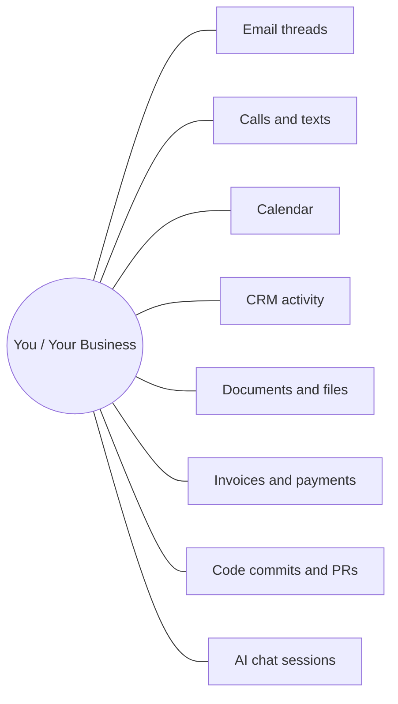

<p align="center">
  
</p>

# Graphory

**Stop your AI from forgetting your business.**

Graphory is the cross-AI business memory layer. Your emails, calls, invoices, CRM, and chat sessions land in one typed knowledge graph that any AI client can query, write to, and reason over across sessions, tools, and models.

```bash
pip install graphory
graphory login
```

```python
from graphory import Graphory
g = Graphory.from_config()
results = g.search("what have we discussed about pricing this quarter")
```


## Built for

- **AI developers** wiring agents and tired of losing context every session
- **Indie founders and solo operators** who want their AI to remember every conversation and follow-up
- **Consultants and agencies** managing client knowledge across projects, calls, and contracts
- **Asset managers and portfolio owners** running multiple companies on one memory
- **Operations and established businesses** that need durable vendor, customer, and compliance history
- **Researchers and domain experts** building citation memory and source tracking
- **Claude Code, Cursor, ChatGPT, Hermes, and OpenClaw users** sharing one memory across every AI

One API key. One MCP endpoint. Every agent sees the same graph.

## What is Graphory?

Graphory is real business memory for AI agents. It ingests your operational data (Gmail, QuickBooks, Slack, CRM, calls, invoices, files) into a typed knowledge graph, then lets any AI client read and write that graph through HTTP or MCP.

The differentiators:

- **Operational data, not just chat.** Real emails, invoices, call logs, and CRM records, joined on real entities (people, companies, accounts, threads).
- **Cross-AI memory.** Every AI client can save chat sessions to your graph and read sessions saved by other clients. Claude Desktop saves a strategy thread, Cursor reads it the next day, Hermes references it the week after.
- **Per-organization isolation.** Your data lives in its own graph. Nothing crosses orgs.
- **Encrypted credential vault.** No plaintext on disk. Tokens stay yours (bring your own credentials).
- **Deterministic extraction.** No LLM in the ingestion pipeline. Same input, same graph, every run. Zero inference cost, zero drift, zero hallucinated invoices.
- **Temporal provenance.** Every node and edge carries source, confidence, authority, and timestamp. Full audit trail.

The SDK is thin and open source. The Graphory service behind it does the heavy lifting: a universal extractor, a master ontology that accumulates across users, identity resolution, and the cross-AI session layer.

## What you can build

You walked into the meeting and needed to remember:

- The last three emails from this person
- That call two weeks ago
- The invoice question from January
- What you told ChatGPT yesterday about the strategy

You should not have to remember any of it. Your AI should.

Every AI tool starts from zero. Every new session is amnesia. Stop telling every AI the same backstory.

Graphory is your business memory. One graph. Every conversation, every transaction, every document, every chat session. Any AI can read it. Any AI can write to it. Across sessions, tools, and models.



<details>
<summary>ASCII fallback if Mermaid does not render</summary>

```
        Email threads     Calls and texts
                \\           /
   Calendar -----  You / Your Business  ----- CRM activity
                /           \\
    Documents and files       Invoices and payments
                /             \\
   Code commits and PRs       AI chat sessions
```

</details>

Every line above is a real connection in your graph. Click around in your AI client and any edge can become the answer.

### Picture yourself here

**You are building an AI product.**
You ran a Claude session last week debugging an agent. Today you are in Cursor on the same agent. Yesterday you asked ChatGPT about a related bug. Ask any of them: "What conversations have I had about the failure in the identity resolver?" One answer, drawn from all three sessions.

**You are an indie founder, pre-revenue.**
You emailed 30 potential customers last month. You called five. One introduced you to a colleague. Two went dark. Ask your AI: "Who responded positively, and who hasn't replied in 14 days?" The answer is your follow-up list, ranked by real activity.

**You are a consultant managing 12 clients.**
Every client has emails, documents, calls, maybe invoices. Ask your AI: "What did I tell ClientA about scope changes last quarter?" The answer cites the specific email, the specific meeting, the specific contract version.

**You manage a portfolio of companies.**
Three operating businesses, each with their own bookkeeper, vendors, customers. Ask your AI: "Which customer hasn't paid us in any company for 60+ days?" The answer crosses every connected source.

**You run operations for an established business.**
You need to reconstruct a vendor relationship from two years ago. Ask your AI: "Pull everything about the SupplyCo relationship: emails, calls, invoices, contracts." The answer is a complete timeline, in order, with sources.

**You are a researcher.**
Every paper you read, every source you cite, every conversation with a colleague. Ask your AI: "What did Dr. M say about the protein folding question, and what papers did I cite alongside it?" Real recall over your actual knowledge work.

## Architecture

```
Your real data (Gmail, QuickBooks, Slack, CRM, phone, calendar, files)
         |
         v
Encrypted credential vault (per-org isolation, no plaintext on disk)
         |
         v
Universal extractor (deterministic, zero LLM, replay-safe, $0 inference)
         |
         v
Per-org isolated knowledge graph (typed nodes, temporal provenance)
         |
         v
Your AI client (Hermes, OpenClaw, Claude Code, Cursor, ChatGPT, custom)
   via MCP at api.graphory.io/mcp or HTTPS at api.graphory.io
```

A small set of generic node labels covers any domain - call `describe_schema` for the live list. Industry-specific facets live as properties, not as new node types.

## Free tier

Start free. 100,000 nodes, no credit card, full read and write access. Connect your tools, query from your AI, see what business memory feels like before you pay a cent. Pro and Business tiers when you outgrow it. Pricing: [graphory.io/pricing](https://graphory.io/pricing).

## Quick start

```bash
pip install graphory
graphory login   # one-time auth, stores config at ~/.graphory/config.json
```

```python
from graphory import Graphory

g = Graphory.from_config()

# Search across the graph
results = g.search("what have we discussed about pricing this quarter")

# Multi-hop traversal
paths = g.traverse("contact:client@example.com", depth=2)

# Timeline for an entity
events = g.timeline(entity="acme-co", days=30)

# Write a finding back to the graph
g.write(
    action="upsert_node",
    label="Person",
    node_id="contact:new@example.com",
    properties={"name": "New Contact"},
    confidence=0.95,
)
```

## API surface

**HTTP endpoints** (api.graphory.io):
- `POST /search` keyword search across the org graph
- `GET /entity/{id}` full entity with 1-hop neighborhood
- `POST /traverse` multi-hop traversal
- `GET /timeline/{entity}` temporal activity feed
- `POST /write` confidence-gated node and edge writes
- `GET /stats` node and edge counts by type
- `POST /ingest` universal webhook ingestion

**MCP tools** (api.graphory.io/mcp): read, write, and review tools for any AI client. See [docs.graphory.io/mcp](https://docs.graphory.io/mcp) for the full list.

**Authentication:** `gs_ak_` API keys, one per org. The same key works from HTTP, MCP, and the Python SDK.

Full reference: [docs.graphory.io/api](https://docs.graphory.io/api).

## Teach your AI

Graphory ships portable **skills** - drop-in instruction files any MCP-aware AI (Claude Code, Cursor, Claude Desktop, and others) picks up - so your agent knows how to use your graph well, not just call the API.

- **save-to-graph** - capture any content (chat, transcript, article) as clean, linked memory: learn the schema, check what already exists, write only what is new.
- **save-on-stop** - auto-save a working session when it ends, so the next session in any tool starts with context.
- **morning-brief** - a daily situational brief assembled from your graph and rendered by your own AI.
- **cleanup-stale** - keep the graph clean by adjudicating ambiguous matches, with you in the loop.

Skills run entirely on your AI subscription: Graphory provides the data, your agent does the synthesis. Browse [`skills/`](skills/) and runnable [`examples/`](examples/).

## How it compares

**Is Graphory like Mem0?**
Mem0 remembers chat. Graphory remembers your business: emails, invoices, calls, CRM activity, plus chat sessions. When you ask "what did we tell that customer last quarter," the answer is the actual email thread, not a paraphrased note.

**Is Graphory like Zep?**
Zep is an enterprise chat-context lake. Graphory is operational memory: real business activity tied to real people, real companies, real engagements. Different input, different output.

**Is Graphory like Cognee?**
Cognee builds graphs from conversation with LLMs writing into the graph as they go, which drifts over time. Graphory's core extraction is deterministic: same input, same graph, every run. The AI advisor layer is bounded to suggestions you approve, not core writes.

**Why no LLM in the extraction pipeline?**
Three reasons: zero inference cost, replay-safe (same input equals same output, always), and you never get a hallucinated invoice. Predictability is the feature.

**How does memory work across my different AI clients?**
Every AI client can save chat sessions to your graph and query previous sessions saved by other clients. Claude Desktop saves a strategy conversation, Cursor reads it later, Hermes references it tomorrow. One graph, every AI, every session. This is the killer feature no chat-bound memory product can match.

## Links

- Homepage: [graphory.io](https://graphory.io)
- Pricing: [graphory.io/pricing](https://graphory.io/pricing)
- Docs: [docs.graphory.io](https://docs.graphory.io)
- MCP guide: [docs.graphory.io/mcp](https://docs.graphory.io/mcp)
- Benchmarks: [docs.graphory.io/benchmarks](https://docs.graphory.io/benchmarks)
- Issues: [github.com/groundstone-group/graphory-sdk/issues](https://github.com/groundstone-group/graphory-sdk/issues)
- PyPI: [pypi.org/project/graphory](https://pypi.org/project/graphory/)

## License and status

MIT licensed. Beta status (semver from 0.1.0). API surface is stable; minor changes during the beta are documented in `CHANGELOG.md`. Open an issue if something breaks.
